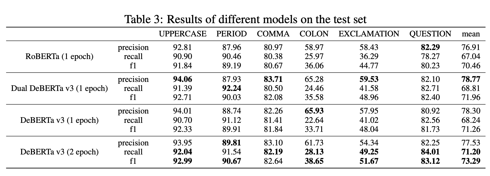
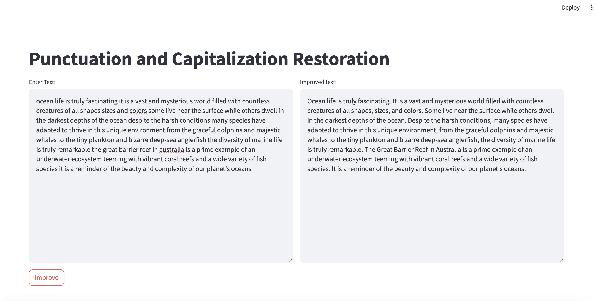

# Transformers for Punctuation and Capitalization Restoration

Accurate punctuation and capitalization are essential for the clarity of written text. However, many texts, particularly those generated by Automatic Speech Recognition (ASR) systems, often lack proper punctuation and capitalization. 
This paper explores the utilization of a pre-trained DeBERTa v3 transformer encoder model to predict and restore punctuation and capitalization in English text. 
For the task of punctuation restoration, the focus is on five punctuation marks: Period, Comma, Colon, Question Mark, and Exclamation Mark. 
The model was fine-tuned and evaluated on a subset of the Gutenberg Project corpus, comprising 3036 books. 
It achieves an overall F1 score of 73.29%, displaying particularly strong performance in identifying capitalized words and periods. 
The performance varies for other punctuation marks, with the model showing a lower performance for colons and exclamation marks, likely due to their infrequent occurrence and diverse usage in the dataset.
The study also reveals that employing a single model to simultaneously predict punctuation and capitalization is nearly as effective as using dedicated models for each task. 
This unified approach results in only a minor decrease in performance while significantly reducing computational resource requirements.

# Results

## Set Up Streamlit Application

To set up and run the Streamlit application, follow these steps:

### Prerequisites

1. **Clone the Repository:**
   - Use the command `git clone https://gitlab.kit.edu/ulhni/punctuation-project.git` to clone the repository to your local machine.

2. **Create a Virtual Environment (optional but recommended):**
   - Run `python -m venv venv` to create a virtual environment.
   - Activate the environment:
     - On Windows, use `venv\Scripts\activate`.
     - On Unix or MacOS, use `source venv/bin/activate`.

3. **Navigate to the Directory:**
   - Change into the directory of the cloned repository using `cd path/to/punctuation-project`.

4. **Install Required Dependencies:**
   - Install all the required packages by running `pip install -r requirements.txt`.

### Running the Application

5. **Start the Streamlit Application:**
   - Launch the application with `streamlit run app.py`.

Once the application is running, Streamlit will open in your default web browser. You can interact with the application's interface to explore its features.

## Dataset

The dataset can be downloaded from [here](https://shibamoulilahiri.github.io/gutenberg_dataset.html).

## Repository Structure
- `app.py` - Code for the Streamlit application.
- `model.py` - Code related to the model architecture.
- `read_data.py` - Code for creating the train/valid/test split.
- `prepare_data.py` - Text cleaning, label creation, and data formatting.
- `solver.py` - Code related to model training and testing.
- `deberta-v3-base` - Stored models and training results.
- `roberta-base` - Stored models and training results.
- `Gutenberg` - Dataset storage location.
- `punc_cap_project.ipynb` - Notebook for experiments and analysis.